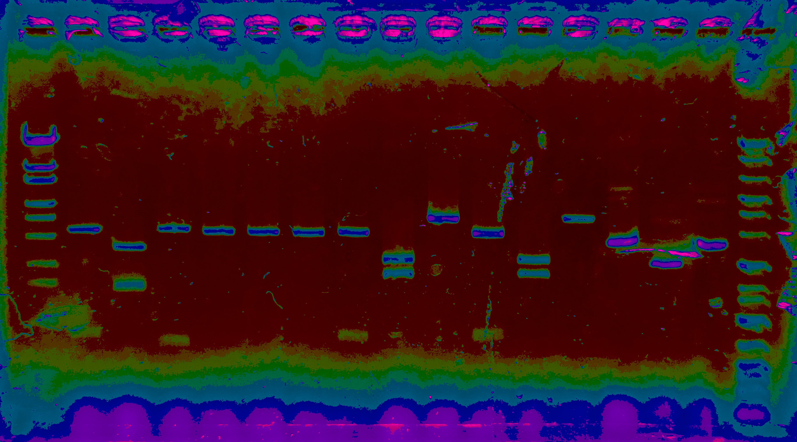
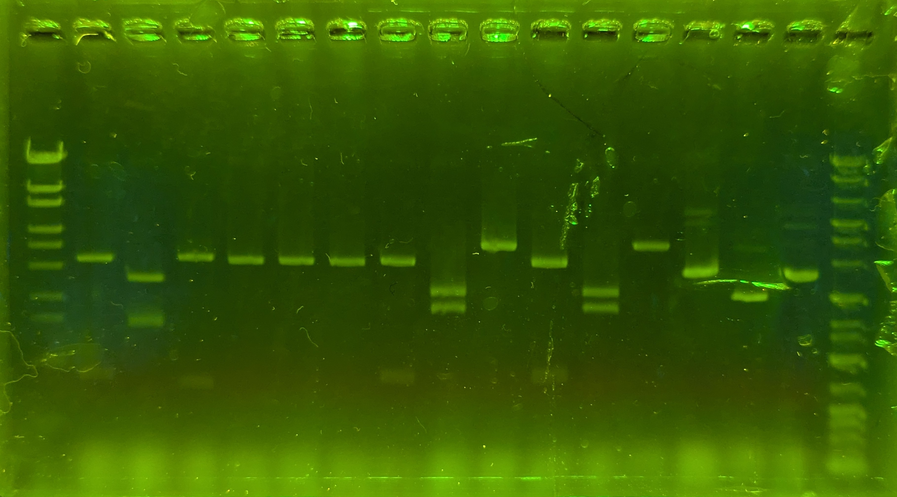

# rainbow_bar.py

電気泳動後の写真の蛍光強度を比較するためのツールです。
下の画像のように、色相を分け蛍光強度を確認することができます。

### rainbow

### 元画像

## 使用方法

1.  `rainbow_bar.py`の`path`に蛍光強度を比較する電気泳動の画像のパスを指定してください。

2.  `rainbow_bar.py`を実行し、表示された`"hsv"`ウィンドウでラダーのバンドをクリックしていきます。クリックするとその蛍光強度以上、他の次に明るい蛍光強度以下の場所が同じ色相で表示されます。
※ バンドが一つの色相で表示されるとは限らないので、バンド全体が背景の色相以外で埋められるくらい指定してください。
※ windowサイズは`resize_and_show_window`関数及び`show_hsv`関数から`resize_rate`を変更することで調整が可能です。

3.  終了時には`esc`を入力して下さい。画像編集後の画像は`{path}_rainbow.{codec}`というファイル名で出力されます。